# Agent Guide

This repository is an STM32CubeMX/CMake firmware project for an STM32F103xB
Blue Pill lyrics display. The firmware scans an SD card for `.mp3` tracks,
loads matching `.lrc` lyric files, and renders a track browser plus animated
lyrics on an SSD1306 OLED display.

## Project Map

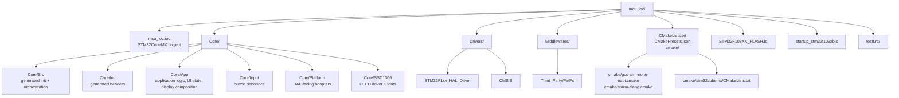

## Main Components

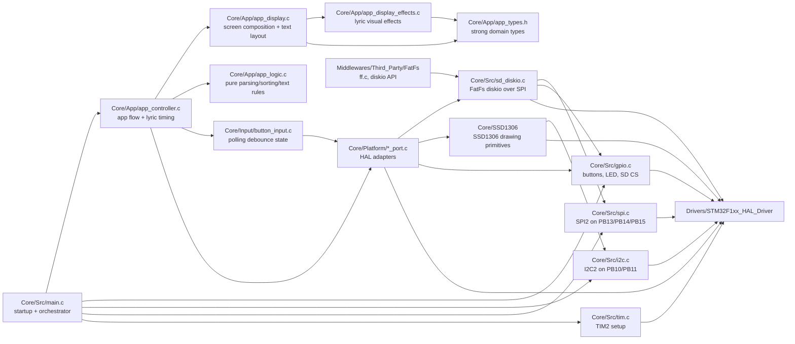

HAL dependencies are intentionally limited to `Core/Src`, `Core/Platform`, and
low-level drivers such as `Core/SSD1306` and `Core/Src/sd_diskio.c`.
High-level `Core/App` and `Core/Input` modules should not include HAL headers,
own HAL handles, or call `HAL_*` APIs directly.

## Firmware Runtime

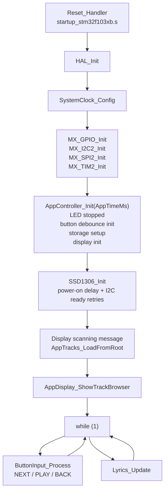

## User Interaction Flow

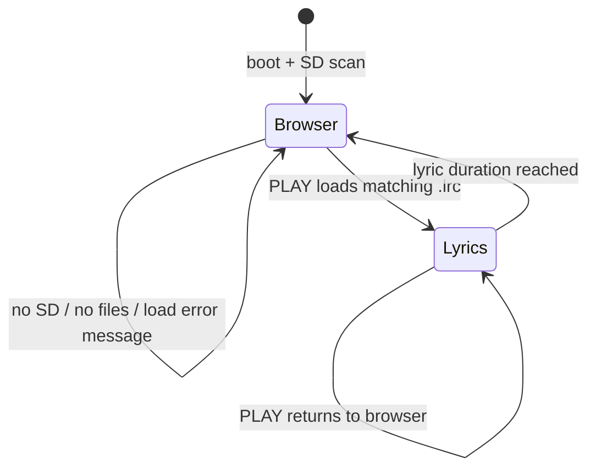

Buttons are currently polled and debounced by `Core/Input/button_input.c`.
`Core/Src/gpio.c` configures `NEXT`, `PLAY_RESUME`, and `BACK` as pulldown
`GPIO_MODE_INPUT` pins, not active EXTI sources.

## Peripheral Wiring Model

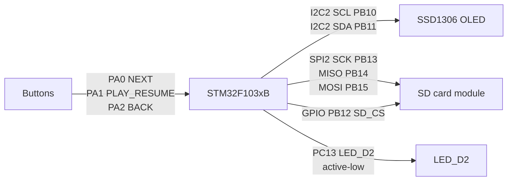

## Storage And Lyrics Flow

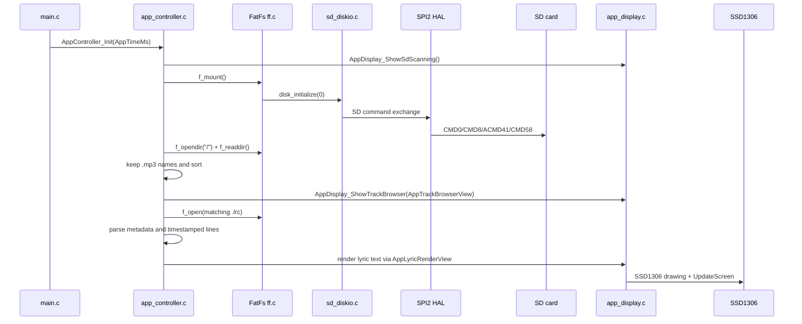

## Display Pipeline

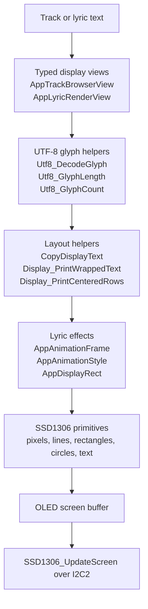

## Build Graph

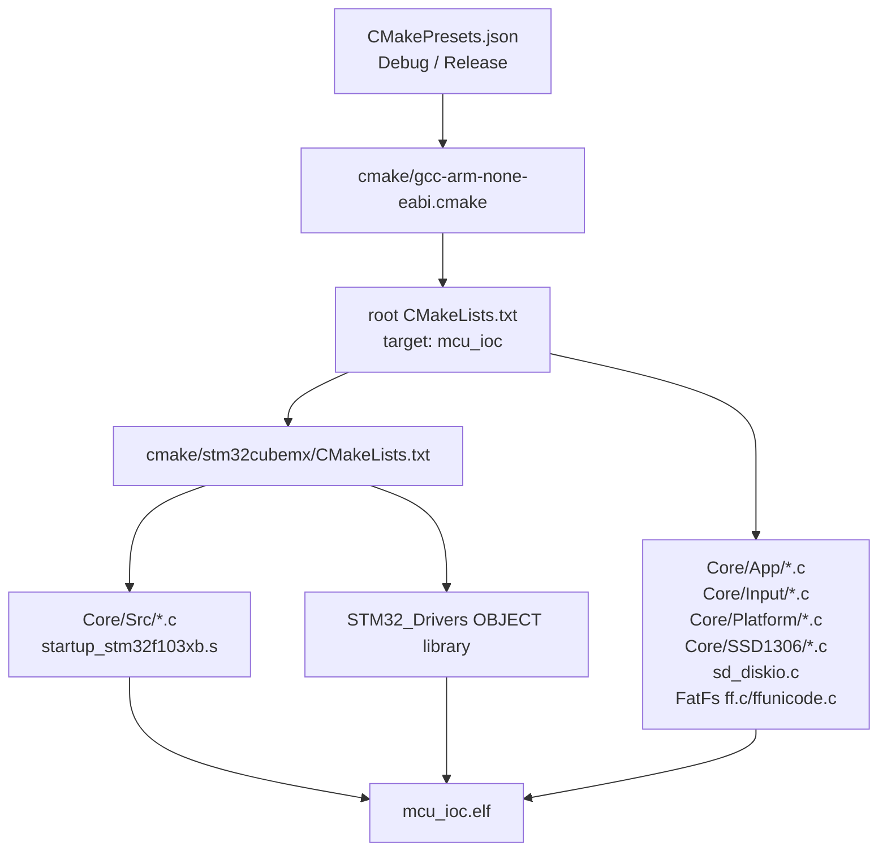

Common commands:

```sh
cmake --preset Debug
cmake --build --preset Debug
cmake --preset Release
cmake --build --preset Release
```

## Host Unit Tests

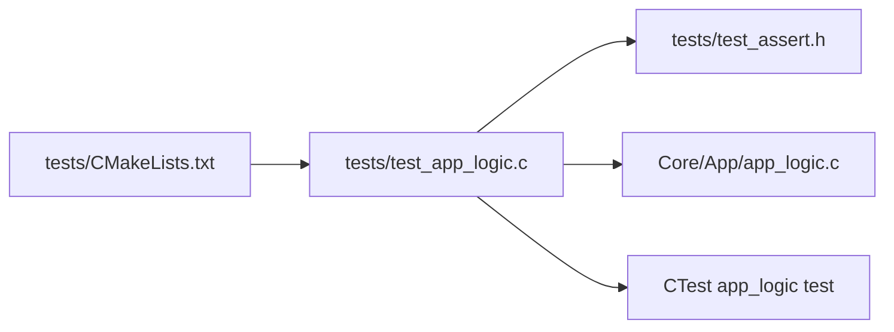

Run host tests through the main project target:

```sh
cmake --preset Debug
cmake --build --preset UnitTests
```

The `unit_tests` target runs CTest with `--verbose` so every `RUN_TEST(...)`
case printed by `tests/test_app_logic.c` is visible even when all tests pass.

Keep high-level rules that do not touch HAL, FatFs handles, GPIO, SPI, I2C, or
the OLED framebuffer in `Core/App/app_logic.c` where they can be compiled by
both the firmware target and the host test target.

## Design Principles

Apply SOLID pragmatically for embedded C. The goal is testable, readable
firmware with clear hardware boundaries, not object-oriented ceremony.

- Single Responsibility Principle: keep parsing, sorting, display layout,
  storage access, and hardware control in separate functions or modules. For
  example, high-level rules belong in `Core/App/app_logic.c`; HAL-dependent
  behavior stays in the firmware layer.
- Open/Closed Principle: add new lyric formats, display effects, or button
  actions by extending tables, enums, or focused helper functions instead of
  rewriting unrelated flows.
- Liskov Substitution Principle: when an interface is represented by function
  groups, callbacks, or adapter modules, callers should not need special cases
  for one implementation. A fake storage/display adapter used by tests should
  obey the same contract as the hardware-backed adapter.
- Interface Segregation Principle: keep module APIs narrow. Do not expose HAL,
  FatFs, or SSD1306 details to pure logic modules unless the caller truly needs
  them.
- Dependency Inversion Principle: high-level rules should depend on small,
  stable abstractions or plain data. Hardware modules should adapt GPIO, SPI,
  I2C, FatFs, and display drivers to those rules, not the other way around.
- Strong domain types: wrap values that have module-boundary meaning, such as
  `AppTimeMs`, `AppAnimationFrame`, `AppAnimationStyle`, and grouped geometry
  like `AppDisplayRect`. Prefer request/view structs such as
  `AppLyricRenderView` over long parameter lists of raw numbers.

Other useful principles for this project:

- KISS: prefer the simplest implementation that is reliable on an STM32F103.
- YAGNI: avoid adding generic frameworks or dynamic allocation until a concrete
  feature needs them.
- DRY: extract duplicated logic when it protects behavior, but avoid premature
  abstraction around tiny one-off hardware setup code.
- Separation of concerns: keep CubeMX-generated init, HAL adapters, app state,
  parsing, and rendering responsibilities distinct.
- Explicit ownership: make buffer sizes, lifetime, and mutation clear at API
  boundaries; fixed-size arrays are preferred in the firmware path.
- Test at the right level: pure logic goes into host unit tests; HAL, timing,
  and peripheral behavior should be isolated behind adapters or verified on
  hardware.
- Fail visibly: return status codes, preserve diagnostics such as SD command
  errors, and render useful display messages when hardware or files are missing.
- Keep generated-code boundaries intact: place custom code in `USER CODE`
  sections or separate modules so CubeMX regeneration is manageable.
- File size and cohesion: keep files small enough to review. A source file
  should normally represent one module or one closely related responsibility.
  Split files when they mix hardware access, app state transitions, parsing,
  storage, rendering, animation, and input handling.
- Hardware isolation: high-level app and input code should depend on project
  ports (`Core/Platform`) and domain types, not directly on HAL handles,
  generated pin macros, or `HAL_*` calls.

## File Size And Modularity

- Use 300-500 lines as a soft target for application `.c` files. Exceeding this
  is acceptable when the file is highly cohesive, such as a font table, display
  primitive driver, generated code, or vendor middleware.
- Do not split CubeMX-generated or vendor files just to satisfy line counts.
- If a file grows past the soft target, identify natural module boundaries
  before adding more code.
- Good module boundaries for this firmware include:
  input/buttons, playback LED, track scanning, track browser state, LRC loading,
  lyric timing, pure app logic, display layout, display effects, SD/FatFs
  adapter, and SSD1306 primitives.
- Prefer small headers that expose only the functions and types needed by other
  modules.
- Avoid making a "common" module for unrelated helpers. Group code by reason to
  change, not by generic utility labels.
- Keep `main.c` focused on startup, peripheral initialization, and top-level
  orchestration.

Current application ownership:

- `Core/Src/main.c` owns HAL startup, CubeMX peripheral init, and passing
  `AppTimeMs` ticks into the app controller.
- `Core/App/app_controller.c` owns app state transitions, track selection,
  lyric timing, and display view construction.
- `Core/App/app_display.c` owns OLED screen composition and text layout.
- `Core/App/app_display_effects.c` owns lyric animation backgrounds and
  highlights.
- `Core/Input/button_input.c` owns polling debounce behavior but reads button
  state through `Core/Platform/button_port.c`.
- `Core/Platform` owns HAL-facing adapters for buttons, LED, display startup,
  and storage diagnostics/setup.

## Error Handling Design

Use multi-layer error handling. Do not create one global error enum just because
different failures are all "errors"; keep error types local to the layer that
understands and can act on them.

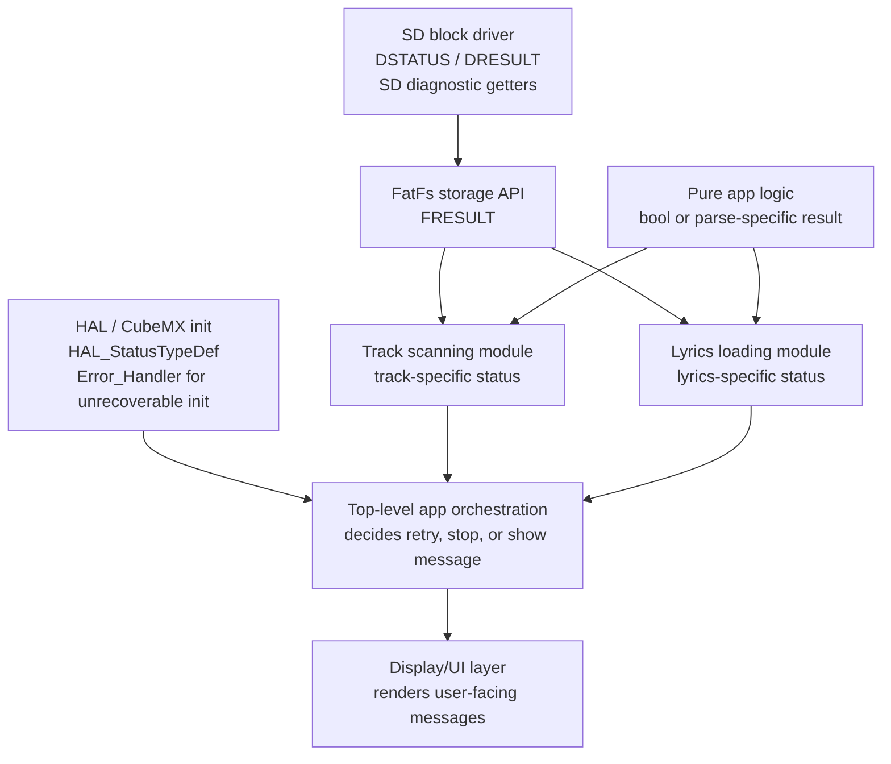

Guidelines:

- Keep low-level diagnostics near low-level code. `sd_diskio.c` owns SD command
  error steps, command numbers, and command responses.
- Keep storage errors in storage-facing modules. FatFs-facing modules may use
  or translate `FRESULT`; pure logic modules should not.
- Keep pure parsing/checking APIs independent from FatFs and HAL. Use `bool` or
  a parse-specific enum when callers need more detail.
- Translate errors at module boundaries. For example, `app_tracks.c` can
  translate `FR_NO_FILESYSTEM` into a track-scan status, and `main.c` can
  translate that status into a display message.
- The UI should render messages; it should not parse SPI, FatFs, or HAL error
  codes directly unless the app explicitly passes a diagnostic string.
- Use `Error_Handler()` only for unrecoverable initialization failures where the
  firmware cannot continue safely.
- Preserve enough diagnostic information to debug hardware failures, but do not
  leak unrelated low-level details through every module API.

Preferred layering:

```text
HAL / hardware init failure        -> Error_Handler()
SD block driver failure            -> DSTATUS / DRESULT + SD diagnostics
FatFs storage operation failure    -> FRESULT inside storage modules
Track scanning failure             -> AppTracksStatus
Lyrics loading failure             -> AppLyricsStatus
Pure parse/check failure           -> bool or parse-specific enum
User-facing failure                -> display message selected by app layer
```

Avoid a global app error enum unless every value is meaningful to every caller.
Prefer module-specific enums such as:

```c
typedef enum
{
  APP_TRACKS_STATUS_OK,
  APP_TRACKS_STATUS_INVALID_PARAMETER,
  APP_TRACKS_STATUS_MOUNT_FAILED,
  APP_TRACKS_STATUS_OPEN_DIR_FAILED,
  APP_TRACKS_STATUS_READ_DIR_FAILED,
  APP_TRACKS_STATUS_NO_TRACKS
} AppTracksStatus;

typedef enum
{
  APP_LYRICS_STATUS_OK,
  APP_LYRICS_STATUS_INVALID_PARAMETER,
  APP_LYRICS_STATUS_FILE_NOT_FOUND,
  APP_LYRICS_STATUS_READ_FAILED,
  APP_LYRICS_STATUS_NO_TIMED_LINES
} AppLyricsStatus;
```

## Naming Conventions

Use the existing STM32CubeMX/HAL style where it already exists. New application
code should be consistent and searchable.

- Public application module functions use Pascal-style module prefixes:
  `AppLogic_ParseLyricLine`, `AppDisplay_ShowTrackBrowser`,
  `SSD1306_UpdateScreen`.
- File-local helper functions use `static` and Pascal-style area prefixes:
  `Display_PrintWrappedText`, `Lyrics_Update`, `ButtonInput_ProcessOne`.
- Generated peripheral init functions keep CubeMX names:
  `MX_GPIO_Init`, `MX_I2C2_Init`, `SystemClock_Config`.
- Types use PascalCase nouns: `ButtonDebouncer`, `AppLyricLine`, `AppMode`.
- Enum constants and macros use upper snake case:
  `APP_MODE_BROWSER`, `BUTTON_INPUT_ACTION_NEXT`, `MAX_TRACKS`.
- Local variables and struct fields use lower snake case:
  `track_count`, `selected_track`, `timestamp_ms`.
- Global HAL handles keep CubeMX names:
  `hi2c2`, `hspi2`, `htim2`.
- Boolean variables should read naturally:
  `display_ready`, `lyric_finished`, `is_playing`.
- Size and time units should be explicit in names:
  `duration_ms`, `timeout_ms`, `track_name_length`.
- Hardware names should include the signal or peripheral where useful:
  `SD_CS_Pin`, `LED_D2_GPIO_Port`, `PLAY_RESUME_Pin`.

## Code Guidelines

- Prefer C11-compatible C. Do not introduce C++ into firmware paths unless the
  build system and startup/runtime costs are intentionally reviewed.
- Keep functions small enough to review. If a function mixes parsing, hardware
  I/O, state mutation, and rendering, split the pure rule from the side effect.
- Put hardware-independent rules in `Core/App` and cover them with host tests.
  Keep HAL, FatFs handles, GPIO writes, I2C, SPI, and OLED framebuffer access
  outside pure logic modules.
- Avoid dynamic allocation in firmware code. Prefer fixed-size buffers with
  named limits and explicit truncation behavior.
- Check buffer sizes before writes. Always leave room for the null terminator
  when handling strings.
- Prefer `uint32_t`, `uint16_t`, `uint8_t`, and `size_t` over plain `int` where
  width, storage, or indexing matters.
- Use wrapper structs for scalar values that cross module boundaries and are
  easy to confuse. Current examples include `AppTimeMs`, `AppAnimationFrame`,
  and `AppAnimationStyle`.
- Group related numbers into domain structs instead of passing long numeric
  lists. Use `AppDisplayPoint`, `AppDisplaySize`, and `AppDisplayRect` for
  geometry, and request/view structs for display calls.
- Do not wrap every local math variable. Raw `uint8_t x`, `uint8_t width`, or
  loop counters are acceptable inside small, low-level drawing helpers where
  the scope is obvious.
- Avoid separate one-field wrappers for every coordinate component unless a
  real bug class justifies the boilerplate. Prefer `AppDisplaySize` over
  distinct `AppWidth` and `AppHeight` types in this firmware.
- Return status codes or `bool` for recoverable failures. Reserve
  `Error_Handler()` for unrecoverable initialization failures.
- Keep blocking waits bounded with timeouts. Avoid adding unbounded loops around
  peripheral or storage operations.
- Cold-start hardware timing must be explicit and bounded. OLED initialization
  waits before the first I2C readiness probe and retries for late power-up
  modules; do not replace this with an unbounded wait.
- Use `const` for read-only pointers and table data.
- Keep module APIs narrow. Expose behavior, not internal buffers, HAL handles,
  or implementation-specific state unless necessary.
- Preserve `USER CODE BEGIN` / `USER CODE END` regions in CubeMX-generated
  files. Prefer separate modules for larger custom code.
- Do not reformat vendor code in `Drivers` or `Middlewares`.
- Add or update host tests when changing `Core/App` behavior. For firmware-only
  behavior, document the manual hardware check or add an adapter seam first.
- Keep comments useful and sparse. Explain non-obvious timing, hardware, memory,
  or protocol decisions rather than restating code.
- Prefer deterministic behavior. Avoid hidden global state in pure logic; when
  state is necessary, make initialization and ownership explicit.

## Code Review Guidelines

Review firmware changes for behavior, hardware safety, and maintainability
before style. Findings should be concrete and tied to file/line references when
possible.

- Correctness: verify state transitions, boundary conditions, parsing edge
  cases, wraparound behavior, and error paths.
- Memory safety: check fixed-buffer writes, null termination, truncation,
  pointer validity, stack growth, and array bounds.
- Embedded constraints: watch RAM/FLASH growth, blocking calls, timeout
  coverage, ISR safety, polling frequency, and assumptions about `HAL_GetTick`.
- Hardware behavior: confirm GPIO polarity, pull configuration, peripheral
  instances, chip-select handling, SPI/I2C timing, and active-low signals.
- Generated code boundaries: ensure CubeMX-owned files are changed only in
  `USER CODE` sections or with a clear reason. Prefer custom modules for
  larger logic.
- Testability: pure behavior should be in `Core/App` and covered by host tests.
  Hardware-dependent changes should have a clear manual verification note or an
  adapter seam that can be tested.
- Build integration: confirm new sources are added to the firmware target and,
  when applicable, host-test CMake. Verify presets still work.
- Error handling: confirm failures return useful status, preserve diagnostics,
  and do not silently leave stale UI or state.
- API design: keep interfaces narrow, const-correct, unit-explicit, and free of
  HAL/FatFs details when the module is meant to be pure logic.
- Strong typing: check that module-boundary scalar values use the appropriate
  wrapper or grouped request struct, and that wrappers are not expanded into
  excessive one-field types for local implementation details.
- Regression risk: compare behavior against existing user flows: SD scan,
  track browser, NEXT/BACK/PLAY, LRC load, lyric timing, display update, and LED
  state.
- Vendor code: avoid reviewing broad generated or vendor formatting churn as if
  it were application logic. Call out unnecessary churn separately.

Before approving a change, run the smallest verification set that covers it:

```sh
cmake --build --preset UnitTests
cmake --build --preset Debug
```

For hardware-facing changes, also document the board-level check performed or
still needed.

## Source Ownership Notes

- Treat files under `Core/Src`, `Core/Inc`, `cmake/stm32cubemx`, and
  `mcu_ioc.ioc` as STM32CubeMX-owned unless the change is inside a
  `USER CODE BEGIN` / `USER CODE END` section or the project already has custom
  edits there.
- `Core/Src/main.c` should remain a startup/orchestration file. Do not move app
  state, display layout, input debounce, or storage logic back into it.
- `Core/Input/button_input.c` contains polled button debounce behavior and uses
  `Core/Platform/button_port.c` for hardware reads.
- `Core/App/app_controller.c` owns track browser state, selected track changes,
  lyric playback timing, and construction of typed display views.
- `Core/App/app_display.c` owns screen composition, text wrapping, UTF-8 glyph
  rendering, and forwarding lyric effects to `app_display_effects.c`.
- `Core/App/app_display_effects.c` owns animation backgrounds and highlights.
- `Core/App/app_types.h` owns small domain wrappers and grouped geometry types.
- `Core/Platform` is the HAL boundary for app-facing hardware adapters.
- `Core/Src/sd_diskio.c` is the FatFs block-device adapter for read-only SD
  access over SPI2. `disk_write` returns `RES_WRPRT`.
- `Core/SSD1306` is the local OLED module. Prefer extending this module for
  reusable drawing primitives and bounded OLED startup behavior; keep
  app-specific layout in `Core/App/app_display.c`.
- `Drivers` and `Middlewares` are vendor code. Avoid broad formatting or
  mechanical edits there.

## Data Model

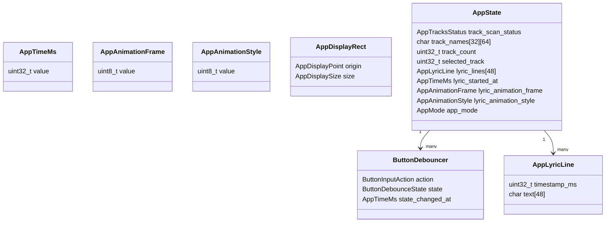

## Practical Guidance For Future Agents

- Start with the module that owns the responsibility: `Core/Input` for buttons,
  `Core/App` for track/lyrics/app rules and display composition,
  `Core/Platform` for HAL-facing adapters, `Core/SSD1306` for display
  primitives, and `Core/Src/main.c` for startup orchestration only.
- Keep memory use fixed-size unless there is a strong reason to change it. This
  firmware avoids dynamic allocation in the application path.
- Be careful with display text lengths: track names are 64 bytes, lyric lines
  are 48 bytes, and the OLED layout assumes an 18-character display line.
- The LED uses active-low logic: `GPIO_PIN_RESET` means playing, and
  `GPIO_PIN_SET` means stopped.
- SD card writes are not implemented. Any feature that modifies card contents
  needs a real `disk_write` implementation and FatFs configuration review.
