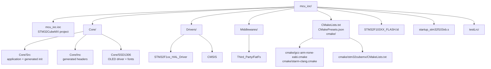
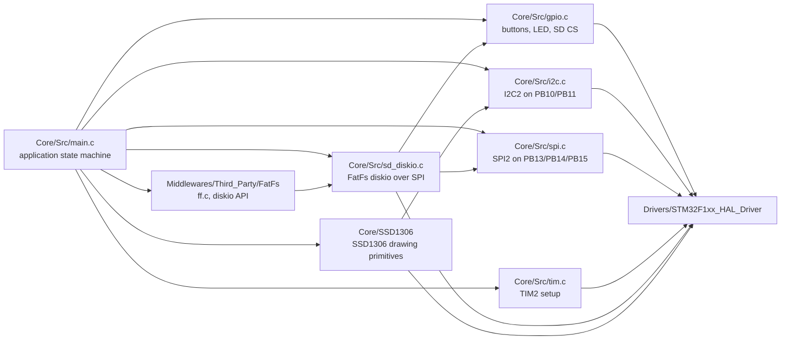
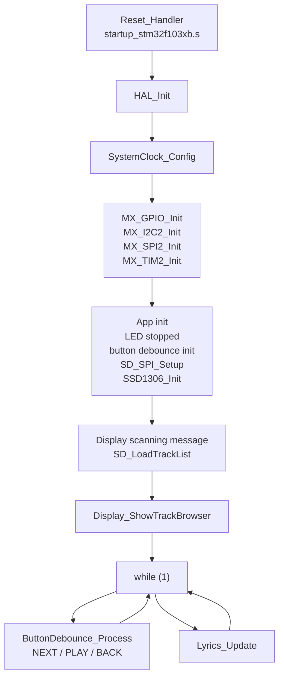
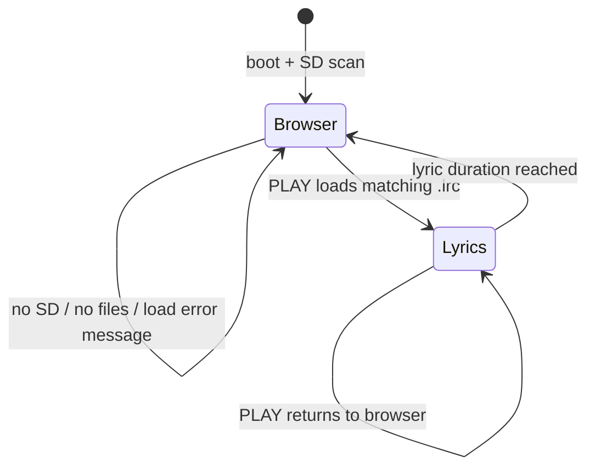
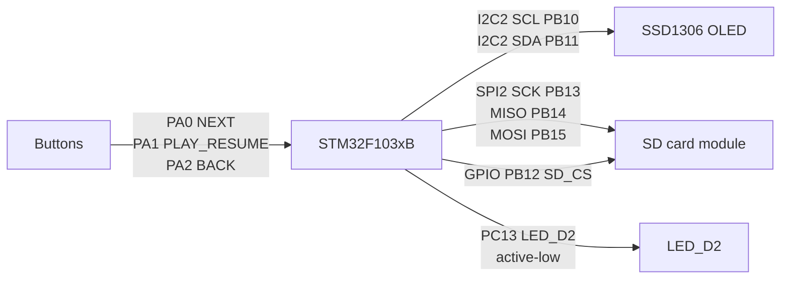
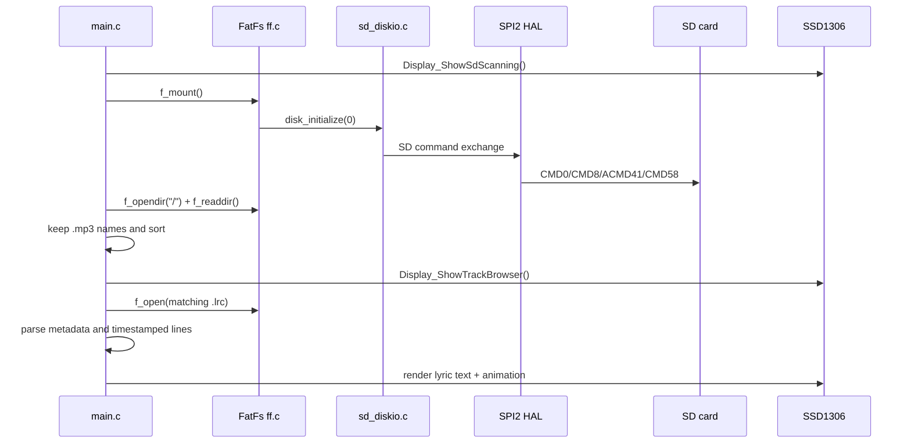
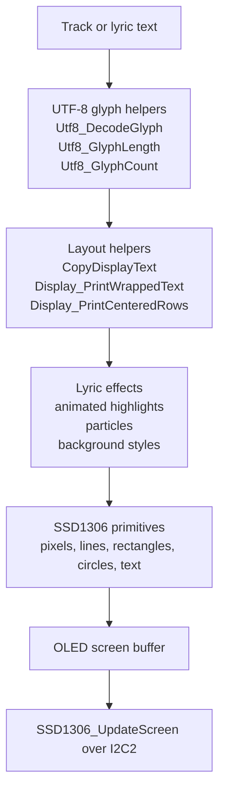
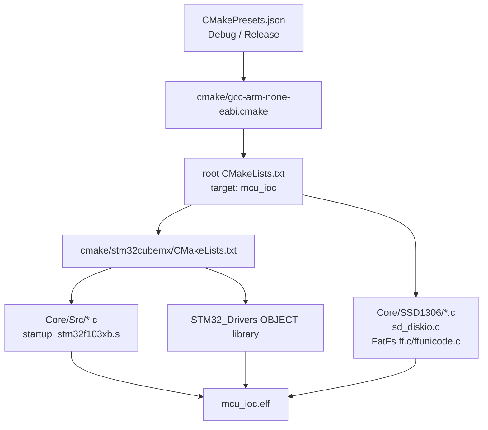
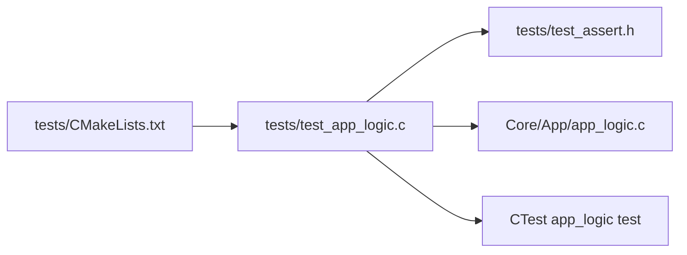
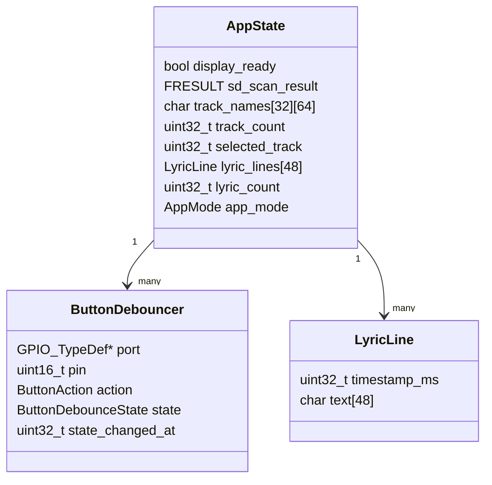

# Agent Guide

This repository is an STM32CubeMX/CMake firmware project for an STM32F103xB
Blue Pill lyrics display. The firmware scans an SD card for `.mp3` tracks,
loads matching `.lrc` lyric files, and renders a track browser plus animated
lyrics on an SSD1306 OLED display.

## Project Map



## Main Components



## Firmware Runtime



## User Interaction Flow



Buttons are currently polled and debounced in `main.c`. `Core/Inc/main.h`
defines EXTI IRQ names for the button pins, but `Core/Src/gpio.c` configures
`NEXT`, `PLAY_RESUME`, and `BACK` as pulldown inputs, not active EXTI sources.

## Peripheral Wiring Model



## Storage And Lyrics Flow



## Display Pipeline



## Build Graph



Common commands:

```sh
cmake --preset Debug
cmake --build --preset Debug
cmake --preset Release
cmake --build --preset Release
```

## Host Unit Tests



Run host tests through the main project target:

```sh
cmake --preset Debug
cmake --build --preset UnitTests
```

The `unit_tests` target runs CTest with `--verbose` so every `RUN_TEST(...)`
case printed by `tests/test_app_logic.c` is visible even when all tests pass.

Keep high-level rules that do not touch HAL, FatFs handles, GPIO, SPI, I2C, or
the OLED framebuffer in `Core/App/app_logic.c` where they can be compiled by
both the firmware target and the host test target.

## Design Principles

Apply SOLID pragmatically for embedded C. The goal is testable, readable
firmware with clear hardware boundaries, not object-oriented ceremony.

- Single Responsibility Principle: keep parsing, sorting, display layout,
  storage access, and hardware control in separate functions or modules. For
  example, high-level rules belong in `Core/App/app_logic.c`; HAL-dependent
  behavior stays in the firmware layer.
- Open/Closed Principle: add new lyric formats, display effects, or button
  actions by extending tables, enums, or focused helper functions instead of
  rewriting unrelated flows.
- Liskov Substitution Principle: when an interface is represented by function
  groups, callbacks, or adapter modules, callers should not need special cases
  for one implementation. A fake storage/display adapter used by tests should
  obey the same contract as the hardware-backed adapter.
- Interface Segregation Principle: keep module APIs narrow. Do not expose HAL,
  FatFs, or SSD1306 details to pure logic modules unless the caller truly needs
  them.
- Dependency Inversion Principle: high-level rules should depend on small,
  stable abstractions or plain data. Hardware modules should adapt GPIO, SPI,
  I2C, FatFs, and display drivers to those rules, not the other way around.

Other useful principles for this project:

- KISS: prefer the simplest implementation that is reliable on an STM32F103.
- YAGNI: avoid adding generic frameworks or dynamic allocation until a concrete
  feature needs them.
- DRY: extract duplicated logic when it protects behavior, but avoid premature
  abstraction around tiny one-off hardware setup code.
- Separation of concerns: keep CubeMX-generated init, HAL adapters, app state,
  parsing, and rendering responsibilities distinct.
- Explicit ownership: make buffer sizes, lifetime, and mutation clear at API
  boundaries; fixed-size arrays are preferred in the firmware path.
- Test at the right level: pure logic goes into host unit tests; HAL, timing,
  and peripheral behavior should be isolated behind adapters or verified on
  hardware.
- Fail visibly: return status codes, preserve diagnostics such as SD command
  errors, and render useful display messages when hardware or files are missing.
- Keep generated-code boundaries intact: place custom code in `USER CODE`
  sections or separate modules so CubeMX regeneration is manageable.

## Naming Conventions

Use the existing STM32CubeMX/HAL style where it already exists. New application
code should be consistent and searchable.

- Public application module functions use Pascal-style module prefixes:
  `AppLogic_ParseLyricLine`, `SD_SPI_Setup`, `SSD1306_UpdateScreen`.
- File-local helper functions use `static` and Pascal-style area prefixes:
  `Display_ShowTrackBrowser`, `Lyrics_Update`, `ButtonDebounce_Process`.
- Generated peripheral init functions keep CubeMX names:
  `MX_GPIO_Init`, `MX_I2C2_Init`, `SystemClock_Config`.
- Types use PascalCase nouns: `ButtonDebouncer`, `LyricLine`, `AppMode`.
- Enum constants and macros use upper snake case:
  `APP_MODE_BROWSER`, `BUTTON_ACTION_NEXT`, `MAX_TRACKS`.
- Local variables and struct fields use lower snake case:
  `track_count`, `selected_track`, `timestamp_ms`.
- Global HAL handles keep CubeMX names:
  `hi2c2`, `hspi2`, `htim2`.
- Boolean variables should read naturally:
  `display_ready`, `lyric_finished`, `is_playing`.
- Size and time units should be explicit in names:
  `duration_ms`, `timeout_ms`, `track_name_length`.
- Hardware names should include the signal or peripheral where useful:
  `SD_CS_Pin`, `LED_D2_GPIO_Port`, `PLAY_RESUME_Pin`.

## Code Guidelines

- Prefer C11-compatible C. Do not introduce C++ into firmware paths unless the
  build system and startup/runtime costs are intentionally reviewed.
- Keep functions small enough to review. If a function mixes parsing, hardware
  I/O, state mutation, and rendering, split the pure rule from the side effect.
- Put hardware-independent rules in `Core/App` and cover them with host tests.
  Keep HAL, FatFs handles, GPIO writes, I2C, SPI, and OLED framebuffer access
  outside pure logic modules.
- Avoid dynamic allocation in firmware code. Prefer fixed-size buffers with
  named limits and explicit truncation behavior.
- Check buffer sizes before writes. Always leave room for the null terminator
  when handling strings.
- Prefer `uint32_t`, `uint16_t`, `uint8_t`, and `size_t` over plain `int` where
  width, storage, or indexing matters.
- Return status codes or `bool` for recoverable failures. Reserve
  `Error_Handler()` for unrecoverable initialization failures.
- Keep blocking waits bounded with timeouts. Avoid adding unbounded loops around
  peripheral or storage operations.
- Use `const` for read-only pointers and table data.
- Keep module APIs narrow. Expose behavior, not internal buffers, HAL handles,
  or implementation-specific state unless necessary.
- Preserve `USER CODE BEGIN` / `USER CODE END` regions in CubeMX-generated
  files. Prefer separate modules for larger custom code.
- Do not reformat vendor code in `Drivers` or `Middlewares`.
- Add or update host tests when changing `Core/App` behavior. For firmware-only
  behavior, document the manual hardware check or add an adapter seam first.
- Keep comments useful and sparse. Explain non-obvious timing, hardware, memory,
  or protocol decisions rather than restating code.
- Prefer deterministic behavior. Avoid hidden global state in pure logic; when
  state is necessary, make initialization and ownership explicit.

## Source Ownership Notes

- Treat files under `Core/Src`, `Core/Inc`, `cmake/stm32cubemx`, and
  `mcu_ioc.ioc` as STM32CubeMX-owned unless the change is inside a
  `USER CODE BEGIN` / `USER CODE END` section or the project already has custom
  edits there.
- `Core/Src/main.c` contains most app behavior: button debounce, track browser,
  LRC parsing, UTF-8 display helpers, lyric timing, and OLED animation effects.
- `Core/Src/sd_diskio.c` is the FatFs block-device adapter for read-only SD
  access over SPI2. `disk_write` returns `RES_WRPRT`.
- `Core/SSD1306` is the local OLED module. Prefer extending this module for
  reusable drawing primitives; keep app-specific layout and lyric behavior in
  `main.c` unless it becomes shared.
- `Drivers` and `Middlewares` are vendor code. Avoid broad formatting or
  mechanical edits there.

## Data Model



## Practical Guidance For Future Agents

- Start with `Core/Src/main.c` for feature work; most behavior is currently
  implemented as file-local static functions.
- Keep memory use fixed-size unless there is a strong reason to change it. This
  firmware avoids dynamic allocation in the application path.
- Be careful with display text lengths: track names are 64 bytes, lyric lines
  are 48 bytes, and the OLED layout assumes an 18-character display line.
- The LED uses active-low logic: `GPIO_PIN_RESET` means playing, and
  `GPIO_PIN_SET` means stopped.
- SD card writes are not implemented. Any feature that modifies card contents
  needs a real `disk_write` implementation and FatFs configuration review.
